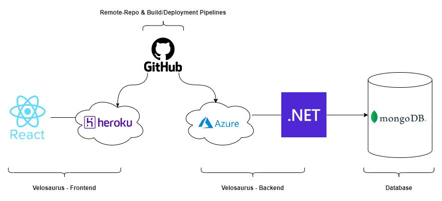

# Velosaurus Frontend

- Backend: **ASP.Net Core**
- Frontend: **React**
- Database: **MongoDB**
- Repo & Pipelines: **Github**
- Hosting: **Heroku** amd **Azure**
  - <https://portal.azure.com/>
  - <https://dashboard.heroku.com/>
- DevOps: **Azure DevOps**
  - <https://dev.azure.com/>



## Prerequisites

- Nodejs
- `npm install` first time after cloning to install dependencies

## Run and Debug

- First, run the development server:

    ```bash
    npm run dev  # run the development server
    npm run lint # run the linter
    ```

- To debug the server, run the `Next.js: debug full stack` launch configuration in VSCode (no specific toggle Auto Attach needed)

- Check <http://localhost:3000>

## Run docker container

[Multi environment docker container](https://github.com/vercel/next.js/tree/canary/examples/with-docker-multi-env)

- `docker build --tag '<image-tag>' .`
- `docker run -p 3000:3000 -e NODE_ENV=production <image-tag> npm start`

OR

- `docker compose build` rebuild image, if changes in code
- `docker compose up` or `docker compose up --build`
- `docker compose down`

Using multistage reduced image size from 2.02 GB to 1.31 GB.

Resources:

- API: <https://portal.azure.com/>
  - <https://velosaurus-api.azurewebsites.net/api/tour>
- DB: <https://cloud.mongodb.com/>

## Project Setup

- `npx create-react-app velosaurus-frontend --template typescript`
- `npm i react-router-dom @types/react-router-dom`
- `npm i axios @types/axios`

Update Dependecies:

- `npm update`
- `npm audit --fix`
- `npm install <package>@latest`
- Reactupdate: `npm install react react-dom @types/react @types/react-dom`

## TODO

- parse/use error object from API, e.g.:

   ```json
   {
  "title": "Item Not Found.",
  "status": 404,
  "detail": "No Velosaurus.DatabaseManager.Models.Activity item found with id 1234.",
  "instance": "/api/Activity/1234"
  }
  ```

- Parse distance / DateTime ...
- Logging & Exception Handling
  - <https://docs.datalust.co/docs/using-nodejs>
- POST example
- resolve enum

## npm Commands

- `npm start`
- `npm test`
- `npm run build`
- `npm run eject`

## Deploy on Vercel

The easiest way to deploy your Next.js app is to use the [Vercel Platform](https://vercel.com/new?utm_medium=default-template&filter=next.js&utm_source=create-next-app&utm_campaign=create-next-app-readme) from the creators of Next.js.

Check out our [Next.js deployment documentation](https://nextjs.org/docs/app/building-your-application/deploying) for more details.

---

# Remarks

## HTML

Practical rules of thumb

- Use `<header>`, `<nav>`, `<main>`, `<footer>` for page‑level structure.
- Use `<article>` for independent pieces that could stand alone.
- Use `<section>` for thematically grouped content with a heading.
- Prefer semantic elements first, fall back to `<div>` when no semantic tag fits.

## NEXT.js

## Structure

```bash
src/
├── app/
│   ├── layout.tsx
│   ├── page.tsx
│   ├── dashboard/
│   │   ├── layout.tsx
│   │   └── page.tsx
│   └── settings/
│       ├── layout.tsx
│       └── page.tsx
├── components/
│   └── Header.tsx
├── styles/
│   ├── globals.css
│   └── Home.module.css
├── utils/
│   └── helpers.ts
```

app/: Contains the main application files and routes. (server code)
components/: Contains reusable React components. (client code)
styles/: Contains global and module-specific CSS files. (client code)
utils/: Contains utility functions and helpers. (client code)

## Server vs CLient side rendering

default is server side rendering in Next.js 13 app directory. To use client side rendering, add "use client" at the top of the file.

Key differences:

- Data Fetching:
  - Client Component: Uses useState/useEffect to manage asynchronous data fetching in the browser
  - Server Component: Fetches data directly on the server before sending HTML to browser

- State Management:
  - Client Component: Needs useState to manage loading/error/data states as they change over time
  - Server Component: No state management needed because data is ready when component renders

- Performance:
  - Client Component:
    - Initial HTML is empty
    - Shows loading state
    - Makes API request from browser
    - Updates DOM when data arrives
  - Server Component:
    - Data is fetched on server
    - HTML arrives with data already in place
    - No loading state needed
    - Better performance and SEO

- Error Handling:
  - Client Component: Needs state to manage errors (setError)
  - Server Component: Handles errors directly in try/catch

The Server Component approach is typically better because:

- Faster initial page load
- Better SEO (search engines see complete content)
- Less client-side JavaScript
- No loading states needed
- Simpler code (no state management)
